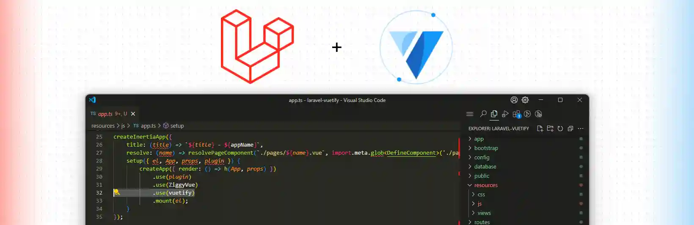

# laravel-vuetify



This is a typical `laravel new` project but using vuetify as the front-end framework. You only have to start building your pages using vuetify components.

## Features
- [Laravel 12.x](https://laravel.com)
- [Vuetify 3.x](https://vuetifyjs.com)

## Installation
Clone the repository
```bash
git clone git@github.com:hstev/laravel-vuetify.git
```
Change directory to the project folder
```bash
cd laravel-vuetify
```
Install the dependencies
```bash
npm install
```
Build the assets
```bash
npm run build
```
Install the Laravel dependencies
```bash
composer install
```
Create a `.env` file and set up your database connection
```bash
cp .env.example .env
```
Generate the application key
```bash
php artisan key:generate
```
Run the migrations
```bash
php artisan migrate
```
Run the development server
```bash
php artisan serve
```
Run the front-end development server
```bash
npm run dev
```